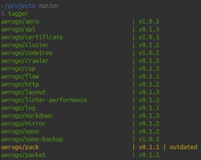

# tagger

Tagger lets you see untagged git commits recursively.



## Installation

```shell
go install github.com/akyoto/tagger
```

## Usage

```shell
tagger
```

Lets you view outdated or untagged git repositories by recursively searching everything in the working directory.

## FAQ

### Why is this needed?

When you manage multiple repositories, it is quite difficult to keep in mind which git repositories were already tagged. This tool helps you remember if your last commit is already tagged or not.

### What does "not tagged" mean?

It means that the repository doesn't have any tags.

### What does "outdated" mean?

It means that your last commit hasn't been tagged yet and users of your repository might still be on an outdated version.

### Can tagger automatically tag the outdated ones?

Not yet, although this feature is work in progress. Feel free to send a PR if you need this functionality.
