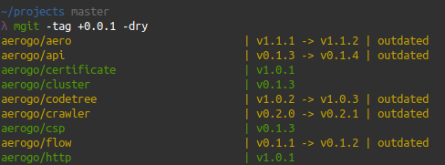
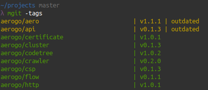
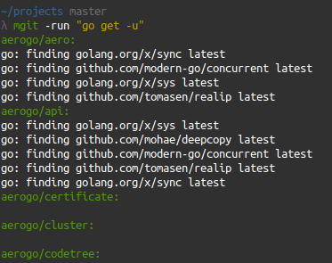

# mgit

mgit (multi git) lets you manage multiple git repositories.

## Installation

```shell
go get -u github.com/akyoto/mgit
```

## Usage

### Increment all semver tags



```shell
mgit -tag +0.0.1
```

```shell
mgit -tag +0.0.1 -dry
```

Adds the given version increment to each tag. Specify `-dry` to stop the actual tagging and only display the diff to confirm the changes. This will never increment repositories where the last commit is already tagged / up to date.

### View tags



```shell
mgit -tags
```

Lets you view outdated or untagged git repositories by recursively searching everything in the working directory.

### Run a command



```shell
mgit -run "go get -u"
```

```shell
mgit -run "npm update"
```

The `-run` flag lets you specify a command to run in every git repository. The command will be executed in parallel (one async routine per repository).

### Setting working directory

```shell
mgit -root ~/ -tags
```

Use `-root` to use a different directory than the current working directory.

## FAQ

### Why is this needed?

* Update dependencies of multiple repos at once
* Get information about multiple repos
* See if your last commits are already tagged or not
* Runs every command in parallel which makes it pretty fast

### What does "not tagged" mean?

It means that the repository doesn't have any tags.

### What does "outdated" mean?

It means that your last commit hasn't been tagged yet and users of your repository might still be on an outdated version.
