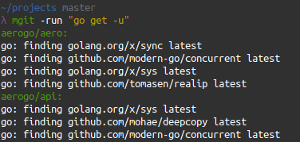

[![Godoc][godoc-image]][godoc-url]
[![Report][report-image]][report-url]
[![Tests][tests-image]][tests-url]
[![Coverage][coverage-image]][coverage-url]
[![Patreon][patreon-image]][patreon-url]

mgit (multi git) lets you manage multiple git repositories.

## Installation

```shell
go get -u github.com/akyoto/mgit/...
```

## Usage

### Increment all semver tags


```shell
mgit -tag +0.0.1
```

```shell
mgit -tag +0.0.1 -dry
```

Adds the given version increment to each tag. Specify `-dry` to stop the actual tagging and only display the diff to confirm the changes. This will never increment repositories where the last commit is already tagged / up to date.

### View tags


```shell
mgit -tags
```

Lets you view outdated or untagged git repositories by recursively searching everything in the working directory.

### Run a command



```shell
mgit -run "go get -u"
```

```shell
mgit -run "npm update"
```

The `-run` flag lets you specify a command to run in every git repository. The command will be executed in parallel (one async routine per repository).

### Setting working directory

```shell
mgit -root ~/ -tags
```

Use `-root` to use a different directory than the current working directory.

## FAQ

### Why is this needed?

* Increase semver tags of multiple repos
* Update dependencies of multiple repos
* Get information about multiple repos
* See if your last commits are already tagged or not
* Runs every command in parallel which makes it pretty fast

### What does "not tagged" mean?

It means that the repository doesn't have any tags.

### What does "outdated" mean?

It means that your last commit hasn't been tagged yet and users of your repository might still be on an outdated version.

## Coding style

Please take a look at the [style guidelines](https://github.com/akyoto/quality/blob/master/STYLE.md) if you'd like to make a pull request.

## Patrons

| [](https://github.com/soulcramer) |
|---|
| [Scott Rayapoullé](https://github.com/soulcramer) |

Want to see [your own name here](https://www.patreon.com/eduardurbach)?

## Author

| [](https://twitter.com/eduardurbach "Follow @eduardurbach on Twitter") |
|---|
| [Eduard Urbach](https://eduardurbach.com) |

[godoc-image]: https://godoc.org/github.com/akyoto/mgit?status.svg
[godoc-url]: https://godoc.org/github.com/akyoto/mgit
[report-image]: https://goreportcard.com/badge/github.com/akyoto/mgit
[report-url]: https://goreportcard.com/report/github.com/akyoto/mgit
[tests-image]: https://cloud.drone.io/api/badges/akyoto/mgit/status.svg
[tests-url]: https://cloud.drone.io/akyoto/mgit
[coverage-image]: https://codecov.io/gh/akyoto/mgit/graph/badge.svg
[coverage-url]: https://codecov.io/gh/akyoto/mgit
[patreon-image]: https://img.shields.io/badge/patreon-donate-green.svg
[patreon-url]: https://www.patreon.com/eduardurbach
